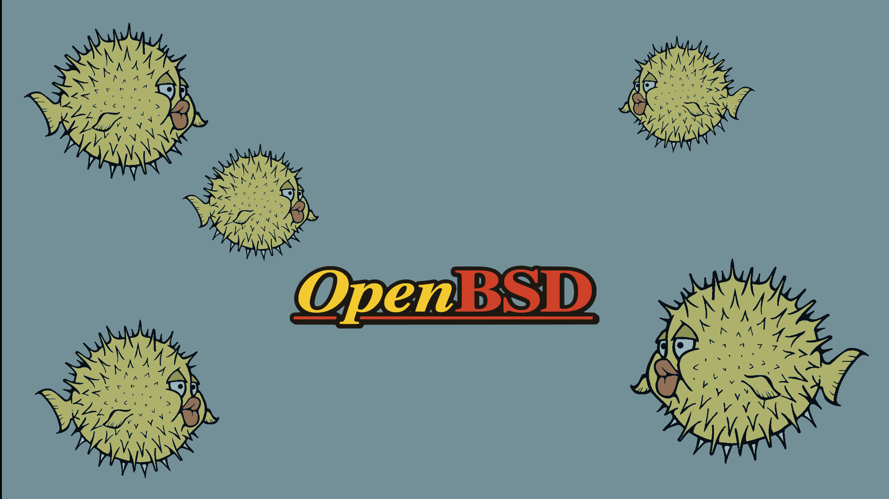

# openbsd-cyberpunk-dots
My personal configuration for OpenBSD. Ultra minimal and full black!!

1. You will need a OpenBSD installation.
2. Clone the repo as user in to your home dir: `git clone https://github.com/unixobserver/openbsd-cyberpunk-dots.git` 
3. Run as root `pkg_add doas vim`
4. Run `vim /etc/doas.conf` and add the following line `permit persist username keepenv as root` and save it. Don't forget to change the word username with your user.
5. Run chsh -s /bin/oksh logout and relogin
6. Cd on openbsd-cyberpunk-dots folder and run on terminal `doas pkg_add -l programs`
7. cd ~/openbsd-cyberpunk-dots/.local/suckless and doas make clean install inside on each folder (dwm, dmenu, st, dwmblocks)
8. Copy all files from ~/openbsd-cyberpunk-dots on to your home directory ~/
9. Run chmod +x ~/.local/bin/* and xdg-user-dirs-update. Put your songs in the Music folder and mkdir ~/Videos/movies and put inside your movies.
10. Enjoy!!

